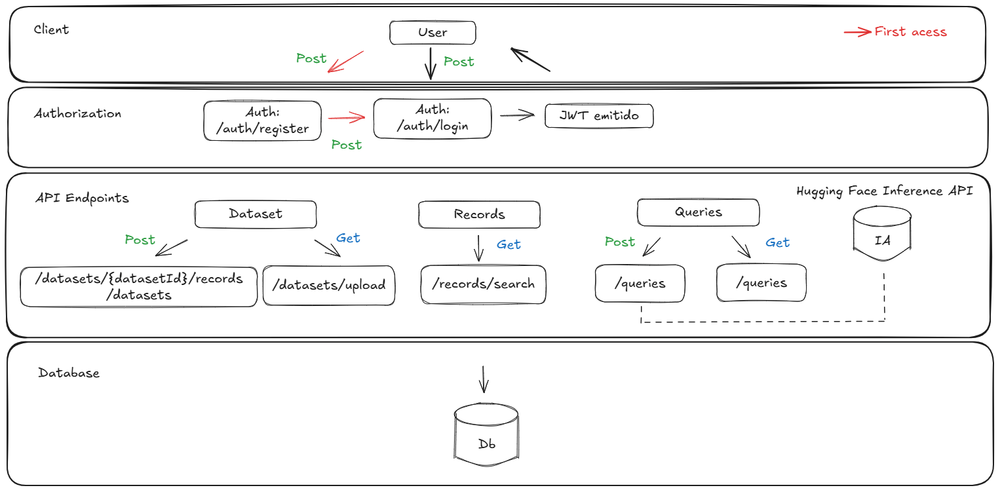

# 📊 Data Query API

API RESTful para ingestão e consulta de dados com simulação de respostas por IA.

---

## 🗺️ Fluxograma da Aplicação



---

## ✅ Funcionalidades

- 📂 Upload e ingestão de arquivos (`.csv` e `.pdf`)
  - Arquivos são armazenados **localmente**
  - Dados extraídos são convertidos e salvos em **formato JSON** no banco de dados
- 🔐 Autenticação de usuários com JWT
- 🔎 Busca textual em datasets
- 🧠 Integração com IA (resposta simulada ou via Hugging Face)
- 🕓 Histórico de consultas com perguntas e respostas
- 📄 Documentação via Swagger
- 🐳 Containerização com Docker

---

## 🚀 Tecnologias Utilizadas

- **Node.js + Express**
- **PostgreSQL + Prisma ORM**
- **JWT para autenticação**
- **Multer para upload de arquivos**
- **Swagger UI para documentação**
- **Docker / docker-compose**
- **Integração com Hugging Face**

---

## 🔧 Instalação

```bash
# Clone o projeto
git clone https://github.com/seu-usuario/data-query-api.git
cd data-query-api

# Copie as variáveis de ambiente
cp .env.example .env

# Instale as dependências
npm install

# Rode o projeto com Docker
docker-compose up --build

# Acesse:
# http://localhost:3333/api-docs → Swagger
# http://localhost:3333 → API
